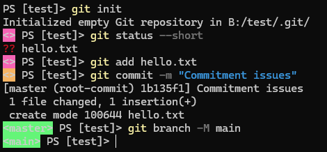

# SGColourPrompt

A simple, easy-to-use colour prompt for the shell.

## Features

- Customizes your shell prompt with vibrant, colour-coded information.
- Displays the current directory, Git branch, and status in a visually appealing format.
- Fully customizable for your needs.

## Installation

### Prerequisites

- PowerShell 5.1 or higher
- The latest version of [Git](https://git-scm.com/book/en/v2/Getting-Started-Installing-Git)

### Via PowerShell Gallery

To install the module via the PowerShell Gallery:

```powershell
Install-Module SGColourPrompt
```

After installation, your prompt should look as follows:



### Via Cloning The Repo

Alternatively, clone the repository from GitHub:

```powershell
git clone https://github.com/suli-g/SGColourPrompt.git
```

## Usage

### If you installed the module [via powershell gallery](#powershell)

- The `prompt` function should take effect immediately.

### If you [cloned the repo](#via-cloning-the-repo)

- You'll need to import the module via the following command:

```powershell
Import-Module path/to/SGColourPrompt
```

### Colour Functions

This module also provides the following functions when [in use](#usage):
|Function|Alias|Effect|
|---|---|---|
|`background_colour`|`bgc`|Sets a background colour for the given text.|
|`foreground_colour`|`fgc`|Sets a foreground colour for the given text.|
|`use-colour`|-|Used to restyle the powershell prompt.[^1]|

[^1]: <https://learn.microsoft.com/en-us/powershell/module/microsoft.powershell.core/about/about_prompts?view=powershell-7.4>

- `foreground_colour`: Sets a foreground colour for the given text.

2. Enjoy your newly styled prompt! It should automatically update and adapt to show contextual information like:

   - Current working directory
   - Git branch (if applicable)
   - Git status indicators:
    - No changes (green)
    - Unstaged changes (red)
    - Staged changes (yellow)
    - Untracked files (red)

3. To persist this setup, add the following to your PowerShell profile:

   ```powershell
   Import-Module path/to/SGColourPrompt
   ```

   To edit your profile, use:

   ```powershell
   notepad $PROFILE
   ```

## Deactivating

### If installed via PowerShell Gallery

```powershell
Remove-Module SGColourPrompt
```

### If cloned the repo

The script should be deactivated between powershell sessions.

## Troubleshooting

- **Git status not appearing**:
  Make sure `git` is installed and available in your PATH. Test by running:
  ```powershell
  git --version
  ```

## Contributions

Contributions are welcome! Feel free to fork the repository, create a branch, and submit a pull request. Whether it's bug fixes, new features, or documentation improvements, your input is valued.

## License

This project is licensed under the [MIT License](./LICENSE).
